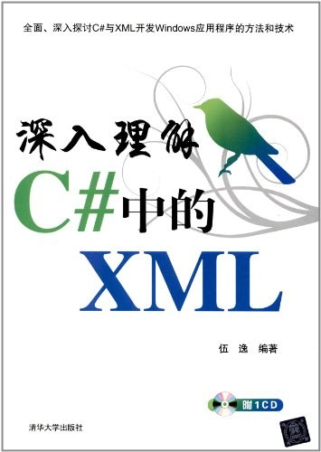

# 深入理解C#中的XML

## 第1章 XML简介

属性：元数据
元素：数据

|实体引用|字符|
|:----:|:----:|
|\&lt;|<|
|\&gt;|>|
|\&amp;|&|
|\&apos;|'|
|\&quot;|"|

> 如果大段内容需要替换成实体引用，可以考虑使用\<![CDATA[...]]>包裹。XML解析器不会解析其中内容，但是内容不能包含]]>。  

DTD：Document Type Definition, ***xml.dtd***  
XML Schema, 代替DTD进行XML文档验证的技术标准  

两种操作XML的模型：流模型和文档对象模型。  
流模型又分“推”和“拉”两种模型。
“推”模型就是SAX(Simple API of XML),靠事件驱动。推荐在处理大文件时使用。  
“拉”模型是.NET的实现方案。从读取器拉去感兴趣的文档部分，不需要引发事件。  
DOM(Document Object Model)支持XPath查询。  
XSLT(Extensible Stylesheet Language Transformations)可扩展样式表转换语言，将XML文档转换为其他文本文档的语言，建立在XML和XPath之上的国际标准。  

## 第2章 使用DOM操作XML
